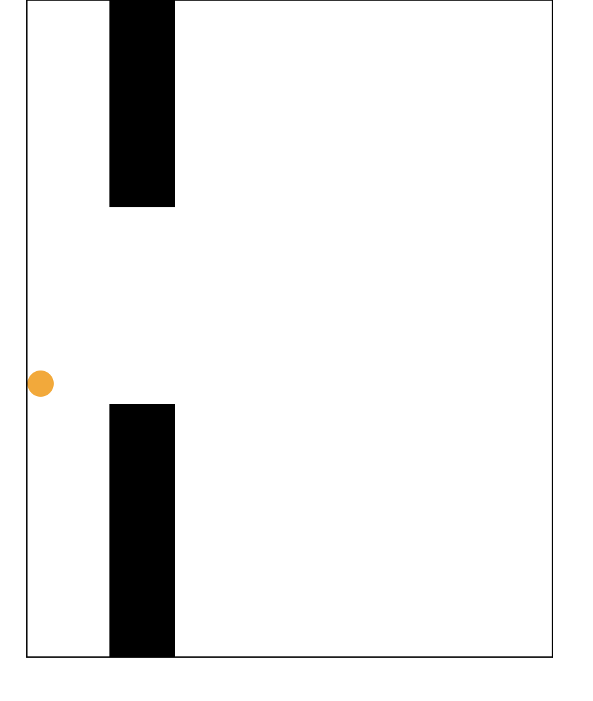

# Flappy_Bird

A game in which a bird that falls due to gravity and jumps on a mouse click.

Flappy Bird Web Game

Welcome to the Flappy Bird Web Game, a classic and addictive game brought to life in your browser using JavaScript! Navigate the friendly blue bird through a series of pipes by tapping or clicking. How far can you go?

Features:

Simple Controls: Just tap or click to make the bird flap its wings and avoid obstacles.
Endless Gameplay: Test your reflexes in an endless, dynamically generated world of pipes.
Responsive Design: Play on any device - desktop, tablet, or mobile - for a seamless gaming experience.
Score Tracking: Challenge yourself and others by achieving the highest scores. Can you beat the record?
How to Play:

Tap or click to make the bird fly.
Navigate through the pipes without hitting them.
Keep tapping or clicking and see how far you can go!
Getting Started:

To start playing, simply visit our website. No downloads or installations required!

Credits:

This Flappy Bird Web Game is powered by JavaScript and HTML5 Canvas.

Share Your High Score:

Challenge your friends and share your high scores on social media! Can they beat your record?

Enjoy the nostalgic fun of Flappy Bird right in your browser. Happy flapping!
